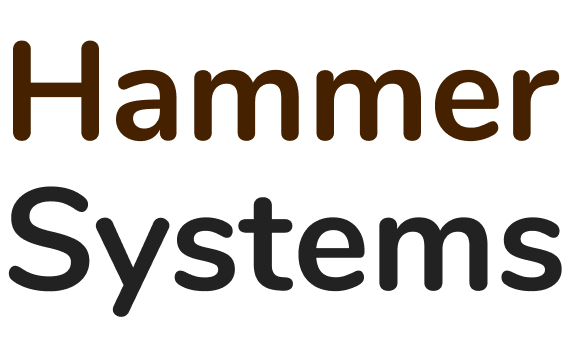

## Тестовое задание компании 
### Приложение упакованно в docker контейнеры(django, postgres, redis)
### Разворачивать с помощью docker
#### Переходим в рабочую деректорию проекта и создаём.env файл:
    cd hammer-system && nano app/.env
#### Добавляем данные созданной базы postgresql и secter_key django:
    DB_NAME='db_name'
    DB_USER='db_user'
    DB_PASSWORD='db_password'
    SECRET_KEY='django-secret-key'
    REDIS_HOST='redis'
    DB_HOST='postgres'
    REDIS_PORT='6379'
    DEBUG=True

### Build and run project with docker:
    docker-compose build
    docker-compose up
##### Документация redoc: 
    0.0.0.0:8000/api/docs/redoc
##### Админка django:
    0.0.0.0:8000/admin/
##### Контейнер django: 
    docker compose exec -it django
##### Создать суперпользователя:
    python manage.py createsuperuser
